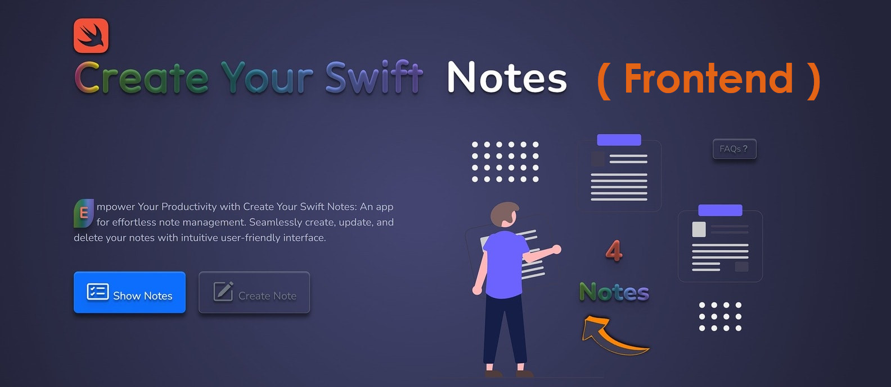

# Swift Notes

[Link to Swift Notes](https://gaganpreetkaurkalsi.netlify.app/)
___

## Used technologies:

___

## What is this app for
Swift-Notes is a React.js application that empowers users to manage their notes seamlessly. 
This app provides a user-friendly interface for creating, storing, editing, deleting, 
and marking notes. With the automatic addition of date and time, 
Swift-Notes ensures that your notes are organized and easily accessible.

## Features:

* Create Notes: Effortlessly create new notes with a simple and intuitive interface.

* Store Notes: All your notes are securely stored within the app, ensuring you never lose important information.

* Edit and Delete: Easily modify your notes or remove them as needed, giving you complete control over your content.

* Mark Notes: Highlight important notes by marking them, making it easier to find and prioritize key information.

* Automatic Date and Time: The app automatically timestamps each note, providing a chronological order of your entries.
___

Feel free to customize this template according to your specific app details and preferences.

